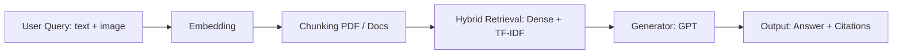

# QA Overview

Mô tả flow tổng quan của phần QA và liệt kê model/kỹ thuật được sử dụng.

## Flow tổng quan


## PDF Chunking and Image Extraction

Mô tả chi tiết về cách chunk PDF và gắn hình ảnh vào chunk.

## 1. Semantic Chunking

```python
_EMBED_MODEL = "BAAI/bge-small-en-v1.5"
_SPLITTER = SemanticSplitterNodeParser(
    buffer_size=1,
    breakpoint_percentile_threshold=95,
    embed_model=_EMBED_MODEL
)
```

* Chia PDF/document thành các semantic chunk dựa trên embedding similarity.
* `buffer_size=1` giúp tránh mất thông tin khi split.
* `breakpoint_percentile_threshold=95` ưu tiên split tại điểm semantic rõ ràng.

### 2. Image Extraction

* Hàm `extract_images` quét cú pháp Markdown: `` trong text.
* Nội suy `figure_id` gần chunk text, để biết hình ảnh liên quan đến đoạn text nào.

## 4. Gắn ảnh vào chunk

```python
chunks.append({
    "doc_id": doc_id,
    "title": title,
    "page": page,
    "text": chunk_text,
    "images": chunk_images if chunk_images else None
})
```

* Nếu không có hình liên quan → `"images": None`.
* Nếu có → `"images"` là danh sách path / metadata của hình liên quan.

---

## 5. Flow Chunking + Image Association

```mermaid
flowchart LR
    P[PDF / Document] --> T[Extract Text & Images]
    T --> S[Semantic Chunking using BGE Small + Splitter]
    S --> C[Associate images to nearby text by figure_id]
    C --> O[Chunks: {doc_id, title, page, text, images/None}]
```

* **P → T**: đọc PDF, trích xuất text và Markdown images.
* **T → S**: chia text thành semantic chunks dựa trên embedding similarity.
* **S → C**: nội suy `figure_id` để gắn ảnh gần chunk.
* **C → O**: output là list chunk, mỗi chunk chứa text + optional images.


#### Models được sử dụng
- Visualized_BGE (`Visualized_m3.pth`) cho embedding: hỗ trợ text và image+text (compose) cho truy vấn/chunks.
- OpenAI Chat Completions (mặc định `gpt-4o-mini`) cho sinh câu trả lời đa phương thức (multimodal) và trích `[cN]` citations.
- Ollama (`llama3.1:8b-instruct`) như lựa chọn sinh text-only khi không dùng OpenAI.

#### Kỹ thuật chính
- RAG pipeline: Retrieve (dense/keyword/hybrid) → Generate (LLM).
- Chunking:
  - Semantic splitting via `llama_index` (nếu khả dụng), fallback heuristic theo đoạn + cửa sổ `max_chars/overlap`.
  - Trích ảnh từ Markdown `` và gán vào chunk theo `figure_id`.
- Retrieval:
  - Dense search với cosine similarity trên vector ảnh+text hoặc text-only.
  - Keyword search bằng TF-IDF bigrams.
  - Hybrid search kết hợp điểm dense + keyword; từ khóa sinh bởi GPT.
- Generation:
  - Multimodal prompt (contexts text + ảnh được chọn) với OpenAI; lựa chọn ảnh theo score/token overlap hoặc include-all.
  - Fallback Extractive (TF-IDF + cosine) khi LLM lỗi/thiếu API.
- Citations: parse các marker `[cN]` từ câu trả lời để sắp xếp và xuất trích dẫn.


