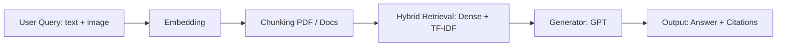
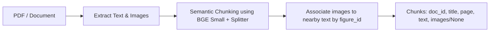
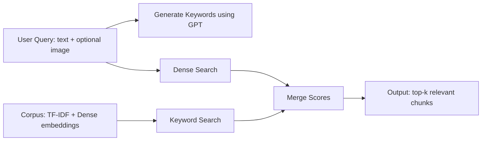
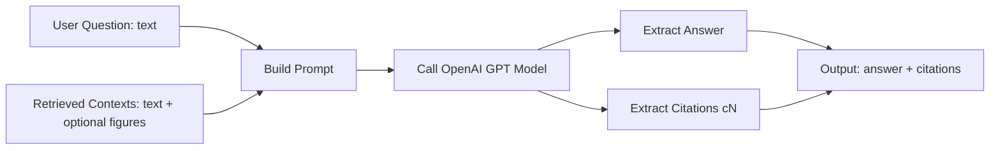

# QA Overview

Mô tả flow tổng quan của phần QA và liệt kê model/kỹ thuật được sử dụng.

## Flow tổng quan


## PDF Chunking and Image Extraction

Mô tả chi tiết về cách chunk PDF và gắn hình ảnh vào chunk.

#### 1. Semantic Chunking

```python
_EMBED_MODEL = "BAAI/bge-small-en-v1.5"
_SPLITTER = SemanticSplitterNodeParser(
    buffer_size=1,
    breakpoint_percentile_threshold=95,
    embed_model=_EMBED_MODEL
)
```

* Chia PDF/document thành các semantic chunk dựa trên embedding similarity.
* `buffer_size=1` giúp tránh mất thông tin khi split.
* `breakpoint_percentile_threshold=95` ưu tiên split tại điểm semantic rõ ràng.

#### 2. Image Extraction

* Hàm `extract_images` quét cú pháp Markdown: `` trong text.
* Nội suy `figure_id` gần chunk text, để biết hình ảnh liên quan đến đoạn text nào.

#### 3. Gắn ảnh vào chunk

```python
chunks.append({
    "doc_id": doc_id,
    "title": title,
    "page": page,
    "text": chunk_text,
    "images": chunk_images if chunk_images else None
})
```

* Nếu không có hình liên quan → `"images": None`.
* Nếu có → `"images"` là danh sách path / metadata của hình liên quan.

---

#### 4. Flow Chunking + Image Association



## Multi-Modal Embedding using Visualized BGE

Mô tả cách tạo embedding cho **query và chunks** sử dụng model Visualized BGE để retrieval text + image.

#### 1. Chuẩn bị model

* Model: [BAAI/bge-visualized](https://huggingface.co/BAAI/bge-visualized)
* Hai weight có sẵn: `bge-visualized-base-en-v1.5` và `bge-visualized-m3`
* Chọn `bge-visualized-m3` để hỗ trợ **multi-language**.

```python
import torch
from visual_bge.modeling import Visualized_BGE

# Load model với weight đã tải
model = Visualized_BGE(
    model_name_bge="BAAI/bge-base-en-v1.5",
    model_weight="path/to/bge-visualized-m3.pth"
)
model.eval()
```

#### 2. Tạo embedding cho query

```python
with torch.no_grad():
    query_emb = model.encode(text="Are there sidewalks on both sides of the Mid-Hudson Bridge?")
```

* Nếu chỉ có text, truyền **text**.
* Nếu có text + image, truyền cả 2 (text và đường dẫn image).

#### 3. Tạo embedding cho candidate chunk

```python
with torch.no_grad():
    candi_emb_1 = model.encode(
        text="The Mid-Hudson Bridge, spanning the Hudson River between Poughkeepsie and Highland.",
        image="./imgs/wiki_candi_1.jpg"
    )
    candi_emb_2 = model.encode(
        text="Golden_Gate_Bridge",
        image="./imgs/wiki_candi_2.jpg"
    )
    candi_emb_3 = model.encode(
        text="The Mid-Hudson Bridge was designated as a New York State Historic Civil Engineering Landmark by the American Society of Civil Engineers in 1983. The bridge was renamed the \"Franklin Delano Roosevelt Mid-Hudson Bridge\" in 1994."
    )
```

* `encode` hỗ trợ **text + optional image**, cho phép multi-modal retrieval.
* Nếu chunk chỉ có text → truyền `text`.
* Nếu chunk có cả hình → truyền `text` + `image`.
## Hybrid Search Flow

Mô tả chi tiết về **Hybrid Search** trong pipeline retrieval.

#### 1. Processing Steps

1. **Keyword Generation**

   * Sử dụng GPT (ví dụ `gpt-4`) để sinh ra danh sách từ khóa từ query.
2. **Keyword Search**

   * Tìm chunk liên quan dựa trên TF-IDF similarity với các từ khóa.
3. **Dense Search**

   * Encode query (text + optional image) thành vector embedding.
   * Tính cosine similarity với dense vectors của chunk.
4. **Score Merging**

   * Kết hợp score: `score = alpha * dense_score + (1 - alpha) * keyword_score`
   * Sắp xếp và chọn top-k chunk theo merged score.

#### 2. Output

* Danh sách **top-k chunk liên quan** với:

  * `index` trong corpus
  * `score` (sau khi kết hợp)
  * `text` chunk
  * `metadata` (title, page, images...)

#### 3. Flow Diagram




## Answer Generation Flow (`generate`)

Mô tả flow của hàm `generate` dùng để tạo câu trả lời từ contexts (text + optional image) bằng GPT.

#### 1. Input

* `question`: câu hỏi của người dùng (text)
* `contexts`: danh sách chunk đã retrieve (text hoặc text + figure)
* `query_image` (optional): hình ảnh kèm theo câu hỏi
* `max_tokens`: số lượng token tối đa khi gọi model

#### 2. Processing Steps

**System Prompt Setup**

   * Hướng dẫn model chỉ dùng thông tin từ `contexts`.
   * Khi dùng context, đánh dấu `[cN]`.
   * Nếu không biết → nói “I don’t know”.
```python
        system = (
            "You are a helpful assistant. Answer strictly using the provided contexts (text and figures). "
            "When referencing a context, add a citation marker like [c1], [c2], ... where the number corresponds to the context index shown. "
            "If unknown, say you don't know."
        )
```

**Call Model (OpenAI Chat Completion)**

   * Model: `self.model` ( `gpt-4o-mini`)
   * Messages: `system` + `user` prompt
   * Parameters: `max_tokens`, `temperature=0.2`

**Extract Answer & Citations**

   * `answer = resp.choices[0].message.content.strip()`
   * Dùng regex `\[c(\d+)\]` để lấy citations `[cN]`
   * Trả về dict:

     ```json
     {
       "answer": "<generated answer>",
       "citations": [list of context indexes]
     }
     ```

#### 3. Output

* `answer`: câu trả lời từ model
* `citations`: index các context được tham chiếu trong answer

#### 4. Flow Diagram



* **Q + C → P**: tạo prompt kết hợp question và contexts
* **P → M**: gửi prompt tới GPT
* **M → A + X**: lấy answer và citations từ response
* **A + X → O**: output cuối cùng trả về user


# QA Output Comparison: Query With vs Without Image

| Feature | Query without Image | Query with Image |
|---------|-------------------|----------------|
| **Question** | different of this image and method of this paper | different of this image and method of this paper |
| **Generator** | openai | openai |
| **Answer** | I don't know. | The image depicts the architecture of the Transformer model, illustrating the cross-attention mechanism. The paper elaborates on self-attention and multi-head attention [c1][c2][c3]. |
| **Cited Sections** | - **[c1] 3.2.1 Scaled Dot-Product Attention** (page 10): To counteract this effect, we scale the dot products by 1 √ d k .<br>- **[c2] 6.3 English Constituency Parsing** (page 25): (2006) [29] ... yielding better results than all previously reported models with the ex<br>- **[c3] 3.5 Positional Encoding** (page 15): We also experimented with using learned positional embeddings [9] instead ... | - **[c1] 3 Model Architecture** (page 6): Figure 1: The Transformer - model architecture. Stacked self-attention and fully connected layers for encoder and decoder.<br>- **[c2] 3.2.2 Multi-Head Attention** (page 11): Multi-head attention allows attending to multiple representation subspaces. Projections: W_Qi, W_Ki, W_Vi, W_O.<br>- **[c3] 4 Why Self-Attention** (page 16): Convolutional layers more expensive than recurrent; separable convolutions reduce complexity. Self-attention improves interpretability. |
| **Figures** | None | - Figure 1: `cross_attention_.png`<br>- Figure 2: `image_000000.png` |
| **Retriever Scores** | N/A | - 0.5296 (index 10)<br>- 0.5296 (index 85)<br>- 0.5126 (index 33)<br>- 0.5126 (index 108)<br>- 0.5079 (index 21) |

---

### Figures from Query with Image

**Figure 1:** Cross-Attention Illustration  


**Figure 2:** Retrieved Chunk Image  


