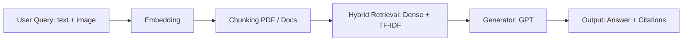

### QA Overview

Mô tả flow tổng quan của phần QA và liệt kê model/kỹ thuật được sử dụng.

#### Flow tổng quan

#### Models được sử dụng
- Visualized_BGE (`Visualized_m3.pth`) cho embedding: hỗ trợ text và image+text (compose) cho truy vấn/chunks.
- OpenAI Chat Completions (mặc định `gpt-4o-mini`) cho sinh câu trả lời đa phương thức (multimodal) và trích `[cN]` citations.
- Ollama (`llama3.1:8b-instruct`) như lựa chọn sinh text-only khi không dùng OpenAI.

#### Kỹ thuật chính
- RAG pipeline: Retrieve (dense/keyword/hybrid) → Generate (LLM).
- Chunking:
  - Semantic splitting via `llama_index` (nếu khả dụng), fallback heuristic theo đoạn + cửa sổ `max_chars/overlap`.
  - Trích ảnh từ Markdown `` và gán vào chunk theo `figure_id`.
- Retrieval:
  - Dense search với cosine similarity trên vector ảnh+text hoặc text-only.
  - Keyword search bằng TF-IDF bigrams.
  - Hybrid search kết hợp điểm dense + keyword; từ khóa sinh bởi GPT.
- Generation:
  - Multimodal prompt (contexts text + ảnh được chọn) với OpenAI; lựa chọn ảnh theo score/token overlap hoặc include-all.
  - Fallback Extractive (TF-IDF + cosine) khi LLM lỗi/thiếu API.
- Citations: parse các marker `[cN]` từ câu trả lời để sắp xếp và xuất trích dẫn.

