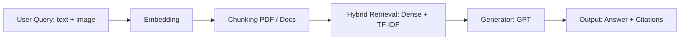
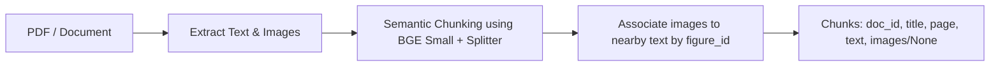

# QA Overview

Mô tả flow tổng quan của phần QA và liệt kê model/kỹ thuật được sử dụng.

## Flow tổng quan


## PDF Chunking and Image Extraction

Mô tả chi tiết về cách chunk PDF và gắn hình ảnh vào chunk.

##Ê 1. Semantic Chunking

```python
_EMBED_MODEL = "BAAI/bge-small-en-v1.5"
_SPLITTER = SemanticSplitterNodeParser(
    buffer_size=1,
    breakpoint_percentile_threshold=95,
    embed_model=_EMBED_MODEL
)
```

* Chia PDF/document thành các semantic chunk dựa trên embedding similarity.
* `buffer_size=1` giúp tránh mất thông tin khi split.
* `breakpoint_percentile_threshold=95` ưu tiên split tại điểm semantic rõ ràng.

### 2. Image Extraction

* Hàm `extract_images` quét cú pháp Markdown: `` trong text.
* Nội suy `figure_id` gần chunk text, để biết hình ảnh liên quan đến đoạn text nào.

### 3. Gắn ảnh vào chunk

```python
chunks.append({
    "doc_id": doc_id,
    "title": title,
    "page": page,
    "text": chunk_text,
    "images": chunk_images if chunk_images else None
})
```

* Nếu không có hình liên quan → `"images": None`.
* Nếu có → `"images"` là danh sách path / metadata của hình liên quan.

---

### 4. Flow Chunking + Image Association



## Multi-Modal Embedding using Visualized BGE

Mô tả cách tạo embedding cho **query và chunks** sử dụng model Visualized BGE để retrieval text + image.

### 1. Chuẩn bị model

* Model: [BAAI/bge-visualized](https://huggingface.co/BAAI/bge-visualized)
* Hai weight có sẵn: `bge-visualized-base-en-v1.5` và `bge-visualized-m3`
* Chọn `bge-visualized-m3` để hỗ trợ **multi-language**.

```python
import torch
from visual_bge.modeling import Visualized_BGE

# Load model với weight đã tải
model = Visualized_BGE(
    model_name_bge="BAAI/bge-base-en-v1.5",
    model_weight="path/to/bge-visualized-m3.pth"
)
model.eval()
```

### 2. Tạo embedding cho query

```python
with torch.no_grad():
    query_emb = model.encode(text="Are there sidewalks on both sides of the Mid-Hudson Bridge?")
```

* Nếu chỉ có text, truyền **text**.
* Nếu có text + image, truyền cả 2 (text và đường dẫn image).

### 3. Tạo embedding cho candidate chunk

```python
with torch.no_grad():
    candi_emb_1 = model.encode(
        text="The Mid-Hudson Bridge, spanning the Hudson River between Poughkeepsie and Highland.",
        image="./imgs/wiki_candi_1.jpg"
    )
    candi_emb_2 = model.encode(
        text="Golden_Gate_Bridge",
        image="./imgs/wiki_candi_2.jpg"
    )
    candi_emb_3 = model.encode(
        text="The Mid-Hudson Bridge was designated as a New York State Historic Civil Engineering Landmark by the American Society of Civil Engineers in 1983. The bridge was renamed the \"Franklin Delano Roosevelt Mid-Hudson Bridge\" in 1994."
    )
```

* `encode` hỗ trợ **text + optional image**, cho phép multi-modal retrieval.
* Nếu chunk chỉ có text → truyền `text`.
* Nếu chunk có cả hình → truyền `text` + `image`.


