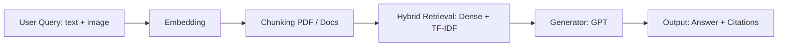
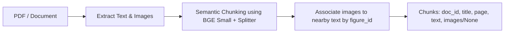
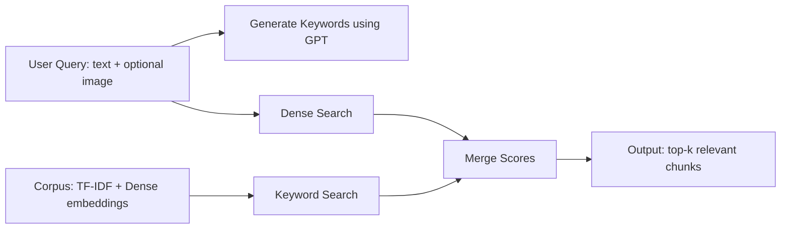
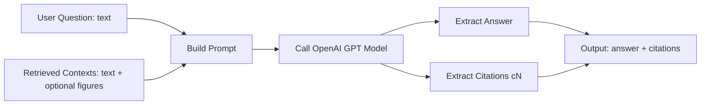

# QA Overview

Overview of the QA flow and listing of models/techniques used.

## Overall Flow


## PDF Chunking and Image Extraction

Detailed description of how to chunk PDFs and attach images to chunks.

#### 1. Semantic Chunking

```python
_EMBED_MODEL = "BAAI/bge-small-en-v1.5"
_SPLITTER = SemanticSplitterNodeParser(
    buffer_size=1,
    breakpoint_percentile_threshold=95,
    embed_model=_EMBED_MODEL
)
```

* Split PDF/documents into semantic chunks based on embedding similarity.
* buffer_size=1 prevents information loss when splitting.
* breakpoint_percentile_threshold=95 favors splitting at clear semantic boundaries.

#### 2. Image Extraction

* The `extract_images` function scans Markdown syntax: `` in the text.
* Interpolates `figure_id` near the text chunk to identify which images are related to the text.

#### 3. Attach Images to Chunks

```python
chunks.append({
    "doc_id": doc_id,
    "title": title,
    "page": page,
    "text": chunk_text,
    "images": chunk_images if chunk_images else None
})

* If no related images → "images": None.
* If there are related images → "images" is a list of paths / metadata of the images.

---

#### 4. Flow Chunking + Image Association



## Multi-Modal Embedding using Visualized BGE

Describes how to create embeddings for **queries and chunks** using the Visualized BGE model for text + image retrieval.

#### 1. Prepare the Model

* Model: [BAAI/bge-visualized](https://huggingface.co/BAAI/bge-visualized)
* Two available weights: `bge-visualized-base-en-v1.5` and `bge-visualized-m3`
* Use `bge-visualized-m3` to support **multi-language**.

```python
import torch
from visual_bge.modeling import Visualized_BGE

# Load the model with the downloaded weight
model = Visualized_BGE(
    model_name_bge="BAAI/bge-base-en-v1.5",
    model_weight="path/to/bge-visualized-m3.pth"
)
model.eval()

#### 2. Create Embedding for Query

```python
with torch.no_grad():
    query_emb = model.encode(text="Are there sidewalks on both sides of the Mid-Hudson Bridge?")

* If only text is available, pass text.
* If both text and image are available, pass both text and the image path.

#### 3. Create Embedding for Candidate Chunks

```python
with torch.no_grad():
    candi_emb_1 = model.encode(
        text="The Mid-Hudson Bridge, spanning the Hudson River between Poughkeepsie and Highland.",
        image="./imgs/wiki_candi_1.jpg"
    )
    candi_emb_2 = model.encode(
        text="Golden_Gate_Bridge",
        image="./imgs/wiki_candi_2.jpg"
    )
    candi_emb_3 = model.encode(
        text="The Mid-Hudson Bridge was designated as a New York State Historic Civil Engineering Landmark by the American Society of Civil Engineers in 1983. The bridge was renamed the \"Franklin Delano Roosevelt Mid-Hudson Bridge\" in 1994."
    )
```

* encode supports text + optional image, enabling multi-modal retrieval.
* If a chunk only has text → pass text.
* If a chunk has both text and image → pass text + image.
* 
## Hybrid Search Flow

Detailed description of **Hybrid Search** in the retrieval pipeline.

#### 1. Processing Steps

1. **Keyword Generation**

   * Use GPT (e.g., `gpt-4`) to generate a list of keywords from the query.

2. **Keyword Search**

   * Retrieve chunks based on TF-IDF similarity with the generated keywords.

3. **Dense Search**

   * Encode the query (text + optional image) into a vector embedding.
   * Compute cosine similarity with the dense vectors of the chunks.

4. **Score Merging**

   * Combine scores: `score = alpha * dense_score + (1 - alpha) * keyword_score`
   * Rank and select the top-k chunks according to the merged score.
 - alpha) * keyword_score`
   * Sắp xếp và chọn top-k chunk theo merged score.

#### 2. Output

* List of **top-k relevant chunks** with:

  * `index` trong corpus
  * `score` (sau khi kết hợp)
  * `text` chunk
  * `metadata` (title, page, images...)

#### 3. Flow Diagram




## Answer Generation Flow (`generate`)

Describes the flow of the `generate` function used to produce answers from contexts (text + optional image) using GPT.

#### 1. Input

* `question`: the user's question (text)
* `contexts`: list of retrieved chunks (text or text + figure)
* `query_image` (optional): image accompanying the question
* `max_tokens`: maximum number of tokens for the model call

#### 2. Processing Steps

**System Prompt Setup**

* Instruct the model to only use information from the `contexts`.
* When using a context, mark it as `[cN]`.
* If the answer is unknown → respond with “I don’t know”.

```python
system = (
    "You are a helpful assistant. Answer strictly using the provided contexts (text and figures). "
    "When referencing a context, add a citation marker like [c1], [c2], ... where the number corresponds to the context index shown. "
    "If unknown, say you don't know."
)

**Call Model (OpenAI Chat Completion)**

   * Model: `self.model` ( `gpt-4o-mini`)
   * Messages: `system` + `user` prompt
   * Parameters: `max_tokens`, `temperature=0.2`

**Extract Answer & Citations**

   * `answer = resp.choices[0].message.content.strip()`
   * Dùng regex `\[c(\d+)\]` để lấy citations `[cN]`
   * Trả về dict:

     ```json
     {
       "answer": "<generated answer>",
       "citations": [list of context indexes]
     }
     ```

#### 3. Output

* `answer`: the answer generated by the model
* `citations`: indices of the contexts referenced in the answer


#### 4. Flow Diagram



* **Q + C → P**: create a prompt combining the question and contexts  
* **P → M**: send the prompt to GPT  
* **M → A + X**: extract the answer and citations from the model response  
* **A + X → O**: produce the final output returned to the user


# QA Output Comparison: Query With vs Without Image

| Feature | Query without Image | Query with Image |
|---------|-------------------|----------------|
| **Question** | different of this image and method of this paper | different of this image and method of this paper [query_image: cross_attetion] |
| **Generator** | openai | openai |
| **Answer** | I don't know. | The image depicts the architecture of the Transformer model, specifically illustrating the cross-attention mechanism involving queries, keys, and values, which are essential components in the attention mechanism. The encoder output and decoder output interact through these components to produce hidden states, as shown in the diagram.\n\nIn contrast, the methods described in the paper focus on the efficiency of self-attention compared to convolutional layers, highlighting the complexity and interpretability of self-attention models. The paper also discusses multi-head attention, which allows the model to attend to different representation subspaces simultaneously, enhancing its ability to capture various aspects of the input data [c1][c2][c5].\n\nThus, while the image provides a visual representation of the Transformer architecture, the paper elaborates on the theoretical underpinnings and advantages of using self-attention and multi-head attention in model design.\n\nFigures (from retrieved contexts):\n- Figure [url: /static/paperreader/services/parser/output/image_000000_536d6dc5957170c29984f94ad0ddf7c2faaaf2cd88b962d1b385f13acf5ba66f.png] |
| **Cited Sections** |  | - **[c1] 3 Model Architecture** (page 6): Figure 1: The Transformer - model architecture. Stacked self-attention and fully connected layers for encoder and decoder.<br>- **[c2] 3.2.2 Multi-Head Attention** (page 11): Multi-head attention allows attending to multiple representation subspaces. Projections: W_Qi, W_Ki, W_Vi, W_O.<br>- **[c5] 4 Why Self-Attention** (page 16): Convolutional layers more expensive than recurrent; separable convolutions reduce complexity. Self-attention improves interpretability. |

---

### Note image

**Query image:** Cross-Attention Illustration  


**Figure 1:** Retrieved Chunk Image  


