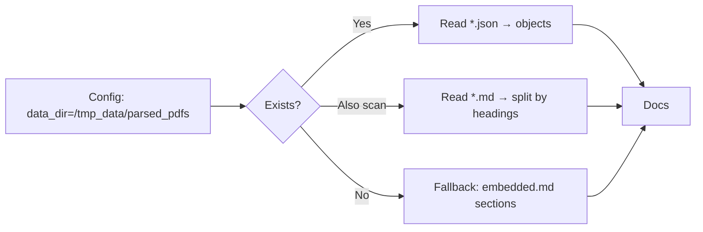
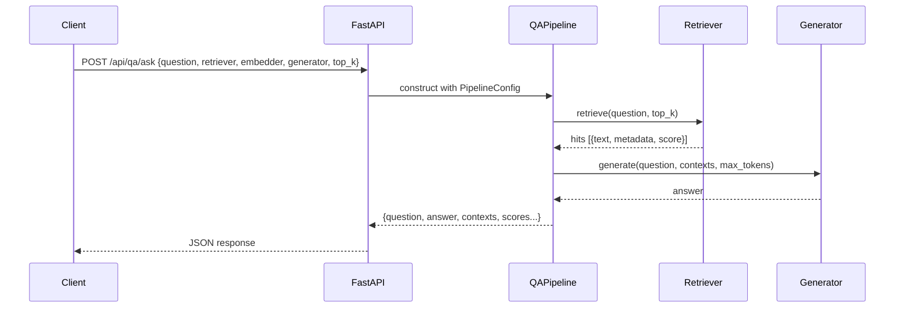
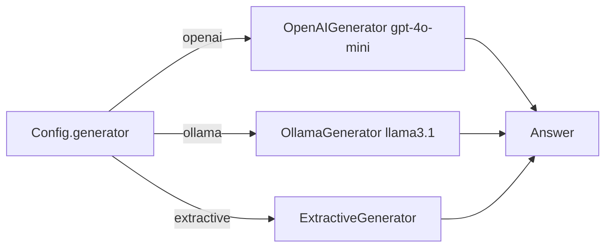
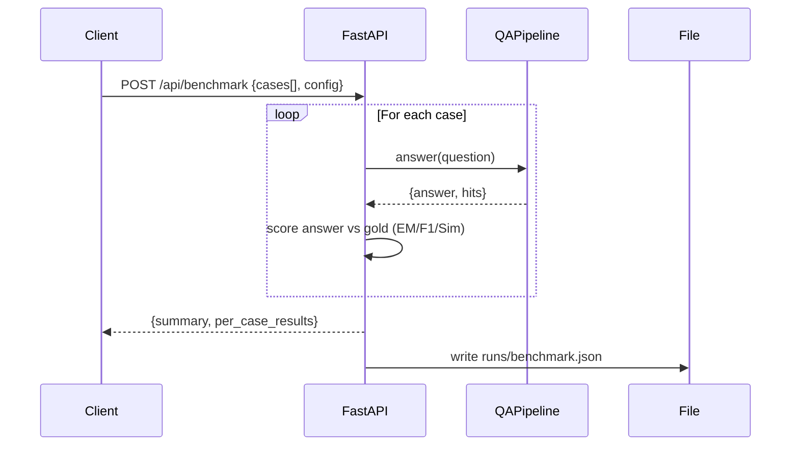

## LOL-PaperReader Backend RAG Pipeline

This document diagrams each stage of the QA pipeline and maps it to existing modules. Defaults:
- Parsed inputs: `/tmp_data/parsed_pdfs/*.json` (configurable)
- Runs/output: `/tmp_data/runs` (configurable)

### 1) Load parsed JSON from /tmp_data/parsed_pdfs/

- Source: `services/loaders.py` → `load_parsed_jsons`
- Config: `services/config.py` → `PipelineConfig.data_dir`
- Fallback: embedded markdown sample if directory absent



Returned structure per doc:
- `doc_id`, `sections` array with `title`, `text`, `page`, optionally `source_path`

### 2) Check the RAG for Single Paper QA #2 for better technique choosing

Use a simple decision heuristic to pick chunking/retrieval/generation strategies, inspired by single-paper QA patterns:

```mermaid
flowchart TB
  Q[Question + Doc characteristics] --> C{Figures present?}
  C -- Many figures/captions --> G1[Gen: gpt-4o-mini (multimodal)]
  C -- Mostly text --> G2[Gen: Extractive or gpt-4o-mini text-only]
  Q --> D{Domain density?}
  D -- High --> R1[Retriever: hybrid]
  D -- Moderate/keyword-rich --> R2[Retriever: keyword]
  D -- Semantics needed --> R3[Retriever: dense]
  Q --> S{Section structure clear?}
  S -- Clear --> CH1[Heuristic chunking]
  S -- Mixed/long --> CH2[Semantic splitter + windowing]
```

Practical defaults:
- Retriever: `hybrid` for robustness on single-paper QA
- Chunker: semantic splitter if available, else heuristic with overlap
- Generator: use multimodal `OpenAIGenerator(gpt-4o-mini)` when figures matter; otherwise `ExtractiveGenerator` or local `OllamaGenerator`

### 3) Split text into chunks and embed

- Chunking: `services/chunking.py` → `split_sections_into_chunks`
  - Optional semantic splitter via `llama_index` if installed
  - Heuristic fallback with `max_chars` and `overlap`
  - Image association: figure-id hits and fuzzy caption overlap
- Embedding: `services/embeddings.py` → `get_embedder`; fallbacks in `services/pipeline.py`

```mermaid
flowchart LR
  A[Docs.sections] --> B{Semantic splitter available?}
  B -- Yes --> C[Split by semantics → window by max_chars/overlap]
  B -- No --> D[Heuristic split by headings + windows]
  C --> E[Associate images by fig-id or caption Jaccard]
  D --> E
  E --> F[Chunks: {text, doc_id, page, images...}]
  F --> G[Embed texts if retriever in {dense, hybrid}]
```

### 4) Create vector store for retrieval

- Corpus: `services/retrievers.py` → `build_corpus`
- Store: `services/retrievers.py` → `build_store`
  - Dense vectors via embedder (if set)
  - TF-IDF matrix for keyword/hybrid
- Store implementation: `services/vectorstore.py` → `InMemoryVectorStore`

```mermaid
flowchart LR
  A[Chunks] --> B[build_corpus → texts, metadatas]
  B --> C[Embed texts (optional) → dense_vectors]
  B --> D[TF-IDF fit → matrix + vectorizer]
  C & D --> E[InMemoryVectorStore]
```

### 5) Implement /api/qa/ask route for question input and answer output

- Route: `api/routes.py` → `@router.post("/ask")`
- Pipeline: `services/pipeline.py` → `QAPipeline.answer`
  - Retrieves top-k
  - Builds contexts (text or text+images)
  - Calls generator
  - Appends figure references if present and supported



### 6) Integrate simple OpenAI gpt-4o-mini or local model for generation

- OpenAI: `services/generators.py` → `OpenAIGenerator(model="gpt-4o-mini")`
  - Requires `OPENAI_API_KEY`
  - Supports multimodal (text + images via data URLs)
- Local: `services/generators.py` → `OllamaGenerator(model="llama3.1:8b-instruct")`
  - Requires Ollama running and model pulled
- Extractive baseline: `ExtractiveGenerator` for fast text-only answers



### 7) Log retrieved passages and answer quality

- Retrieval debug prints in:
  - `services/pipeline.py` → logs hit counts and snippet
  - `services/vectorstore.py` → logs search sims for dense/keyword
- Persist runs/contexts:
  - `runs/last_run_retrieval.json` produced by pipeline (configured via `PipelineConfig.runs_dir`)
- Suggested answer-quality fields:
  - Retrieval scores per hit
  - Used generator, tokens, latency
  - If images included and how many

```mermaid
flowchart LR
  A[Hits + Answer] --> B[Assemble run record]
  B --> C[Write runs/last_run_retrieval.json]
  B --> D[Aggregate metrics (optional)]
```

### 8) Create the structured benchmark for answer quality and retrieval process

- Route scaffold: `api/routes.py` → `@router.post("/benchmark")` (extend)
- Suggested structure:
  - Inputs: list of `{question, gold_answer, doc_id?}`
  - Outputs per item: `{retrieval_hits, scores, answer, exact_match, F1, semantic_sim}`
  - Persist to `runs/benchmark.json` with pipeline config snapshot
- Simple metrics:
  - Exact string match
  - Token F1 (white-space tokenization)
  - Embedding cosine similarity between gold and answer (if available)



### Request/Response examples

Ask:
```bash
curl -X POST http://localhost:8000/api/qa/ask \
  -H 'Content-Type: application/json' \
  -d '{
    "question": "What is the core idea of self-attention?",
    "embedder": "bge-small",
    "retriever": "hybrid",
    "generator": "openai",
    "top_k": 5
  }'
```

Benchmark (suggested):
```bash
curl -X POST http://localhost:8000/api/benchmark \
  -H 'Content-Type: application/json' \
  -d '{
    "cases": [
      {"question": "What is self-attention?", "gold_answer": "Self-attention computes attention weights over tokens ..."}
    ],
    "embedder": "bge-small",
    "retriever": "hybrid",
    "generator": "openai",
    "top_k": 5,
    "max_tokens": 512
  }'
```

### Module map

- Loaders: `services/loaders.py` → `load_parsed_jsons`
- Chunking: `services/chunking.py` → `split_sections_into_chunks`
- Embeddings: `services/embeddings.py` → `get_embedder` and fallbacks
- Vector store: `services/vectorstore.py` → `InMemoryVectorStore` (+ searches)
- Retrieval wiring: `services/retrievers.py` → `build_corpus`, `build_store`, `get_retriever`
- Generators: `services/generators.py` → `OpenAIGenerator`, `OllamaGenerator`, `ExtractiveGenerator`
- Pipeline: `services/pipeline.py` → `QAPipeline._build`, `QAPipeline.answer`
- API: `api/routes.py` → `POST /api/qa/ask`, `POST /api/benchmark` (extend)

### Config and env

- Data dir: `PipelineConfig.data_dir` default `/tmp_data/parsed_pdfs`
- Runs dir: `PipelineConfig.runs_dir` default `/tmp_data/runs`
- OpenAI: set `OPENAI_API_KEY`
- Optional: `RAG_CHUNK_IMAGE_CAPTION_JACCARD` for image-caption association threshold


